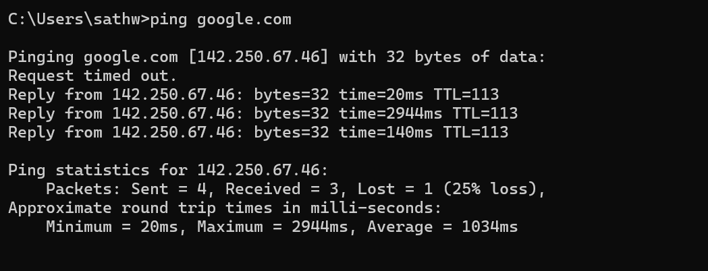
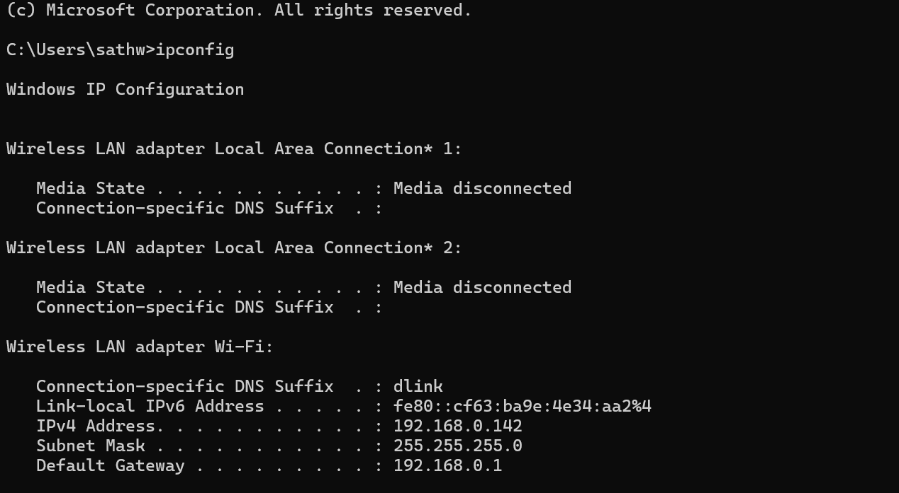
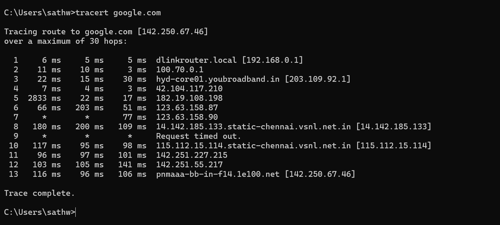

# Network Troubleshooting Lab

## Overview
This project demonstrates basic network troubleshooting using system commands.

## Commands Used
- ipconfig
- ping
- tracert

## What I Did
- Checked IP configuration
- Tested internet connectivity
- Traced network path using tracert
- Observed packet loss and latency

## Screenshots

## Outcome
Gained practical knowledge of troubleshooting network issues using basic tools.